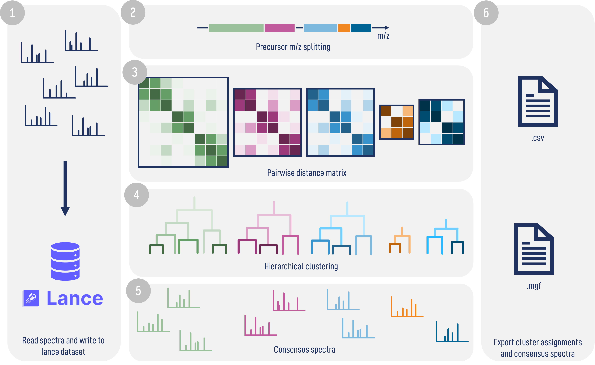

_falcon_
========

For more information:

* [Official code website](https://github.com/bittremieuxlab/falcon)

The _falcon_ spectrum clustering tool uses advanced algorithmic techniques for
highly efficient processing of millions of MS/MS spectra. Spectra are read from
peak files and stored in Lance columnar datasets, partitioned by precursor
charge. Within each charge bucket spectra are split into batches by precursor
_m_/_z_, a full pairwise cosine distance matrix
is computed in parallel using Numba-accelerated code, and hierarchical
clustering is applied to group similar spectra into clusters.

The software is available as open-source under the BSD license.

If you use _falcon_ in your work, please cite the following publication:

- Wout Bittremieux, Kris Laukens, William Stafford Noble, Pieter C. Dorrestein.
**Large-scale tandem mass spectrum clustering using fast nearest neighbor
searching.** _Rapid Communications in Mass Spectrometry_, e9153 (2021).
[doi:10.1002/rcm.9153](https://doi.org/10.1002/rcm.9153)

Installation
------------

_falcon_ requires Python 3.8+ and is available on the Linux and OSX platforms.

You can easily install _falcon_ with pip:

    pip install falcon-ms

Running _falcon_
----------------

_falcon_ can be run from the command line, with settings specified as
command-line arguments or set in an INI config file. _falcon_ takes peak files
(in the mzML, mzXML, or MGF format) as input and exports the clustering result
as a comma-separated file with each MS/MS spectrum and its cluster label on a
single line. Representative spectra for each cluster can optionally be exported
to an MGF file.

Example _falcon_ run with some relevant command-line arguments:

    falcon peak/*.mzml falcon --export_representatives --precursor_tol 20 ppm --fragment_tol 0.05 --distance_threshold 0.10

This will cluster all MS/MS spectra in mzML files in the `peak` directory with
the specified settings and write (i) the cluster assignments to the `falcon.csv` file, and (ii) the cluster representatives to the `falcon.mgf` file.

Important settings
------------------

Here we provide information on the most important settings that influence the
_falcon_ clustering performance. All settings have sensible default values
which should give good results for a wide variety of datasets.

For detailed information on all available settings, run `falcon -h` or
`falcon --help`.

**Spectrum comparison**

- `precursor_tol`: The precursor mass tolerance and unit (in ppm or Dalton) to
compare spectra to each other. Default is 20 ppm.
- `rt_tol`: Optional retention time tolerance (in seconds) to restrict
clustering to spectra with similar retention times. Default is no retention
time filtering.
- `fragment_tol`: The fragment mass tolerance (in Dalton) used during spectrum
comparison. Default is 0.05 Da.

**Clustering**

- `linkage`: The linkage criterion for hierarchical clustering. It should be one
of `single`, `complete`, or `average`. Default is `complete`.
- `distance_threshold`: The cosine distance threshold at which clusters are cut
from the hierarchical tree. This parameter crucially governs cluster purity
(i.e. clusters contain spectra corresponding to only a single peptide).
Values between 0.05 and 0.15 typically yield pure clusters; values up to 0.30
can be used for more aggressive merging. Default is 0.10.
- `min_matched_peaks`: Minimum number of matched fragment peaks required to
consider two spectra similar. Spectra pairs below this threshold are assigned
a distance of 1.0. Default is 0; typically set to 6 for metabolomics data.
- `batch_size`: Maximum number of spectra per precursor _m_/_z_ batch.
Default is 32768.
- `precursor_charge_buckets`: Charge state groupings that determine which
spectra can be clustered together. Each bucket is a list of charges (e.g. `[1]`,
`[2, 3]`); `unknown` matches spectra with a missing charge and `other` catches
any charge not matched by a named bucket. By default this option is not set,
in which case every distinct charge (including missing charges) is caught and
clustered separately. To group charges instead, pass one bucket per argument,
e.g. `[1]` `[2]` `[3]` `[4]` `[unknown]` `other`.

**Consensus spectrum**

- `consensus_method`: Method used to compute the representative spectrum for
each cluster. Either `medoid` (the spectrum with the lowest average distance
to all others in the cluster) or `average` (intensity-averaged spectrum with
optional outlier rejection). Default is `medoid`.
- `outlier_cutoff_lower` and `outlier_cutoff_upper`: Number of standard
deviations below/above the median intensity used for outlier rejection when
`consensus_method=average`. Default is 1.5 for both.

**Spectrum preprocessing**

There are several options to configure spectrum preprocessing prior to the
clustering. The default settings are intended for clustering bottom-up
proteomics data. When analyzing metabolomics or top-down data, these settings
likely need to be adjusted accordingly.

- `min_peaks` and `min_mz_range`: Discard spectra with fewer than the specified
number of peaks, or peaks spanning a smaller _m_/_z_ range between the minimum
and maximum _m_/_z_ value. Default values are minimum 5 peaks and 250 _m_/_z_
range. It is recommended to reduce these values when clustering metabolomics
data.
- `min_mz` and `max_mz`: The minimum and maximum peak _m_/_z_ value,
respectively. Peaks outside these values will be discarded. Default values are
101 _m_/_z_ and 1500 _m_/_z_, respectively.
- `scaling`: Scale the peak intensities by their square root, logarithm, rank,
or no scaling. Default is no scaling, with square root scaling often giving good
results as well. Note that the scaling method can influence the cosine threshold
`distance_threshold`.

How does it work?
-----------------

1. Input peak files (mzML, mzXML, or MGF) are read in parallel and preprocessed
spectra are written to per-charge Lance columnar datasets stored in the working
directory.
2. Within each charge bucket, spectra are sorted by precursor _m_/_z_ and split into overlapping batches of at most
`batch_size` spectra.
3. For each batch a full pairwise cosine distance matrix is computed using a
Numba-parallelized routine. Peak pairs with fewer than `min_matched_peaks`
matched fragments are treated as maximally distant (distance = 1.0).
4. Hierarchical clustering is performed on the pairwise distance matrix using
the `fastcluster` library. The dendrogram is cut at `distance_threshold` using
the chosen `linkage` criterion to produce flat clusters.
5. One representative (consensus) spectrum is selected or computed for each
cluster and, if requested, exported to an MGF file.
6. Cluster assignments are exported to a csv file, while consensus spectra are written to an mgf file.

Contact
-------

For more information you can visit the
[official code website](https://github.com/bittremieuxlab/falcon) or reach out to the Bittremieux Lab.
